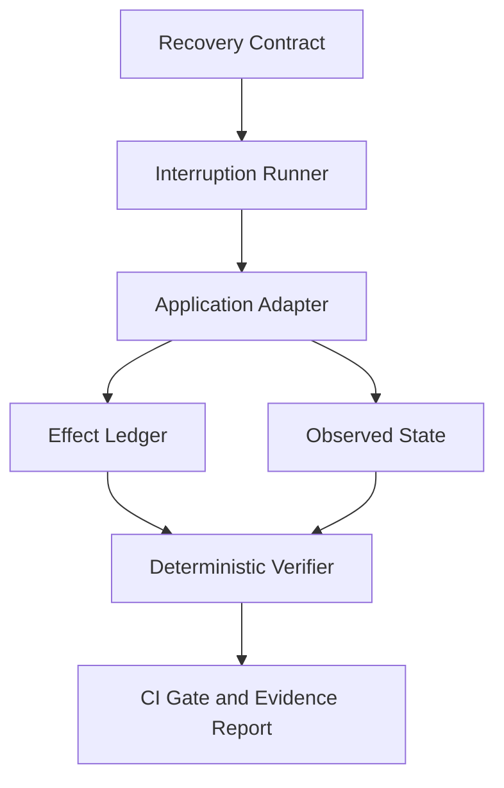

# SecondChance Lab

**Chaos testing for user journeys. Break a critical flow at the worst moment and prove it still completes safely, clearly, and exactly once.**

[](https://github.com/MadanMohan0537/secondchance-lab/actions/workflows/ci.yml)
[](LICENSE)
[](package.json)
[](tsconfig.json)

Most end-to-end tests answer one question: **Did the happy path finish?**

SecondChance Lab tests the moments when the client no longer knows what happened:

- a payment request reached the server, but the response timed out;
- an invite succeeded, but the page displayed an error;
- a user refreshed while a record was being created;
- a webhook arrived twice or out of order;
- an agent tool call completed, but the agent never received confirmation.

These are **ambiguous outcome windows**. Blind retries inside them create duplicate charges, repeated invitations, orphaned records, and users asking, “Did it go through?”

SecondChance Lab defines the required recovery behavior as code, injects interruptions at meaningful boundaries, records actual side effects, and applies deterministic invariants in CI.

> The explorer may be intelligent. The verifier must be deterministic.

## What is working today

This repository contains an executable backend-first foundation, not a landing-page prototype.

| Capability | Status |
|---|---|
| Recovery Contract validation | Implemented |
| Natural-language contract drafts | Implemented |
| Contract composition | Implemented |
| Contract linter and safe fixes | Implemented |
| Semantic contract diffing | Implemented |
| Deterministic interruption fuzzing | Implemented |
| Recovery coverage analysis | Implemented |
| Contract mutation-testing primitives | Implemented |
| Versioned template-registry primitives | Implemented |
| Effect Ledger | Implemented |
| Exactly-once, range, and state verification | Implemented |
| Concurrent interruption sweeps | Implemented |
| Markdown evidence reports | Implemented |
| Vulnerable and resilient checkout simulations | Implemented |
| Browser, webhook, queue, mobile, and agent adapters | Planned |
| Hosted replay dashboard and integrations | Planned |

The project deliberately distinguishes implemented behavior from roadmap intent. See the [complete product roadmap](docs/roadmap.md).

## How it works



The architecture separates five responsibilities:

1. **Recovery Contract** describes the action, interruption windows, permitted effects, state assertions, and failure budget.
2. **Runner** executes every selected interruption scenario independently.
3. **Application Adapter** drives the system under test and observes its state.
4. **Effect Ledger** records durable truth such as a charge, invite, email, order, or reversal.
5. **Verifier** checks the evidence. It never relies on an agent’s opinion to determine pass or fail.

## Quick start

Requirements: Node.js 20 or newer.

```bash
git clone https://github.com/MadanMohan0537/secondchance-lab.git
cd secondchance-lab
npm install
npm run check
```

Run the deliberately vulnerable checkout:

```bash
npm run demo
```

The command is expected to fail. It writes `.secondchance/report.md` and demonstrates two defects:

- a lost acknowledgement can produce two successful charges;
- a refresh can leave the UI uncertain even when the backend says `paid`.

Now run the idempotent implementation:

```bash
npm run dev -- run examples/checkout.recovery.yml \
  --adapter resilient \
  --out .secondchance/resilient-report.md
```

## A Recovery Contract

Contracts live beside application code and receive normal pull-request review.

```yaml
version: 1
name: checkout-exactly-once

action:
  name: submit-payment
  idempotencyKey: checkout-session-id

windows:
  - id: after_send_before_ack
    family: request
  - id: after_commit_before_response
    family: request
  - id: refresh_during_processing
    family: session

invariants:
  effects:
    - effect: charge.succeeded
      exactly: 1
    - effect: order.created
      exactly: 1
  state:
    - path: visible.paymentStatus
      operator: equals
      value: paid

failureBudget:
  safetyViolations: 0
  recoverySuccessRate: 1
  outcomeCertaintyRate: 1
```

This contract says that every tested interruption must produce one charge, one order, a visible `paid` state, no safety violations, and complete recovery certainty.

See the [working checkout contract](examples/checkout.recovery.yml) and [contract reference](docs/contracts.md).

## Authoring contracts

Generate a draft from product language:

```bash
npm run dev -- generate \
  "User invites a teammate; invite sends exactly once; form survives reload" \
  --out examples/invite.recovery.yml
```

The generator returns explicit questions when the description does not define effect cardinality, interruption points, or authoritative backend evidence. It does not silently invent guarantees.

Review the contract’s quality and apply only safe fixes:

```bash
npm run dev -- lint examples/invite.recovery.yml
npm run dev -- lint examples/invite.recovery.yml --fix
```

Compose reusable contracts:

```bash
npm run dev -- compose \
  examples/base.recovery.yml \
  examples/email.recovery.yml \
  --out examples/combined.recovery.yml
```

Detect weakened guarantees between versions:

```bash
npm run dev -- diff before.recovery.yml after.recovery.yml
```

Enumerate fault and timing permutations, then calculate coverage:

```bash
npm run dev -- fuzz examples/checkout.recovery.yml --limit 50
npm run dev -- coverage examples/checkout.recovery.yml
```

## CLI reference

| Command | Purpose |
|---|---|
| `validate <contract>` | Validate schema and invariant structure |
| `generate "<description>"` | Create a deterministic draft from workflow intent |
| `lint <contract> [--fix]` | Find weak or unverifiable recovery guarantees |
| `compose <base> <extension...>` | Combine reusable contract definitions |
| `diff <before> <after>` | Find semantic and breaking recovery changes |
| `fuzz <contract> [--limit N]` | Generate deterministic fault/timing permutations |
| `coverage <contract>` | Measure tested lifecycle-window coverage |
| `run <contract>` | Execute a contract with a selected adapter |
| `demo` | Run the vulnerable checkout demonstration |

Use `--json` with diff, fuzz, or coverage where supported for CI and tool integration.

## Interruption model

SecondChance Lab groups interruptions into teachable lifecycle families instead of maintaining a flat list of unrelated failures.

| Family | Example boundaries | Typical failures |
|---|---|---|
| Request | duplicate click, after send/before acknowledgement, after commit/before response | duplicate or missing effects |
| Session | reload, back navigation, expiration, close/reopen | lost work and ambiguous outcomes |
| Environment | deploy, feature-flag transition, dependency degradation | cross-version and configuration failures |

The current deterministic simulator exercises request and session boundaries. Real infrastructure injection belongs in specialized adapters.

## Effect Ledger

The Effect Ledger is the source of truth for durable side effects:

```json
{
  "runId": "run-123",
  "attemptId": "attempt-2",
  "type": "charge.succeeded",
  "status": "succeeded",
  "externalId": "ch_123",
  "idempotencyKey": "checkout-42",
  "occurredAt": "2026-09-19T14:21:06.000Z"
}
```

The ledger is exposed as a small port. Future adapters can consume payment webhooks, database change records, queues, OpenTelemetry spans, or agent tool calls without changing verification semantics.

## Build an adapter

Implement `ScenarioAdapter` from [`src/types.ts`](src/types.ts):

```ts
import type { ScenarioAdapter } from "secondchance-lab";

export const checkout: ScenarioAdapter = {
  name: "staging-checkout",
  async run(context) {
    // Drive the staging API or browser.
    // Record durable effects through context.ledger.
    // Trigger supported boundaries through context.interrupt(...).
    return {
      recovered: true,
      outcomeCertain: true,
      state: {
        backend: { paymentStatus: "paid" },
        visible: { paymentStatus: "paid" }
      }
    };
  }
};
```

A production adapter should use test accounts, least-privilege read access, isolated data, and deterministic teardown. The included adapters are simulations and do not claim live Stripe or browser integration.

## Report contract

SecondChance Lab keeps the headline metrics deliberately small:

- **Safety violations:** hard failures such as duplicate charges or inconsistent records.
- **Recovery success rate:** interrupted tasks that still reach their intended outcome.
- **Outcome certainty rate:** scenarios where the visible state communicates the system-of-record result.

Detailed traces, ledger entries, violated invariants, and repair suggestions remain available for diagnosis without being compressed into an opaque score.

## Repository structure

```text
src/                    contract, runner, ledger, verifier, and authoring modules
test/                   deterministic unit and integration tests
examples/               executable Recovery Contracts
docs/contracts.md       contract format reference
docs/architecture.md    system boundaries and design decisions
docs/roadmap.md         phased platform roadmap
.github/workflows/      CI verification
```

## Development

```bash
npm test        # execute the Node test suite
npm run build   # compile strict TypeScript
npm run check   # type-check and test
```

Contributions should include tests, documentation, and a reproducible example where applicable. See [CONTRIBUTING.md](CONTRIBUTING.md).

## Security boundary

- Use staging or disposable environments.
- Never place credentials, payment data, PII, or raw production payloads in contracts or ledgers.
- Prefer read-only verification adapters.
- Redact adapter metadata before persisting evidence.
- Treat suggested fixes as reviewable tickets, never automatic production changes.

See [SECURITY.md](SECURITY.md) for reporting and deployment guidance.

## Project status

SecondChance Lab is an early product and research prototype. The current code proves the contract, ledger, interruption, and verification architecture locally. The schema and TypeScript API may change before `1.0`; external provider and browser adapters require design-partner validation.

## License

Licensed under the [Apache License 2.0](LICENSE).
